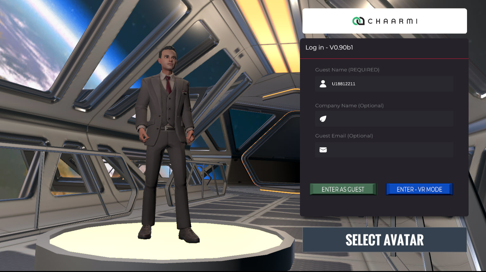

[stars-url]
[linkedin-url]

<!-- PROJECT LOGO -->
 

  

  <h3 align="center">Chaarmi Worlds Metaverse Creation System</h3>

  

    A fast and easy to use no-code web-based metaverse creation system that works on your own server. Build your own metaverse galaxy!
     
    <a href="https://www.chaarmi.com/documentation"><strong>Documentation »</strong></a>
     
     
    <a href="https://www.youtube.com/channel/UCWiJR8FX1KlpwvghRn8CG-A">Video Tutorials</a>
    ·
    <a href="https://discord.gg/BWmF6ehZW5">Join Community Discord</a>
  

<!-- TABLE OF CONTENTS -->

  
Table of Contents

  <ol>
    <li>
      <a href="#about-the-project">About The Project</a>
      <ul>
        <li><a href="#built-with">Built With</a></li>
      </ul>
    </li>
    <li>
      <a href="#getting-started">Getting Started</a>
      <ul>
        <li><a href="#prerequisites">Prerequisites</a></li>
        <li><a href="#installation">Installation</a></li>
      </ul>
    </li>
    <li><a href="#usage">Usage</a></li>
    <li><a href="#roadmap">Roadmap</a></li>
    <li><a href="#license">License</a></li>
    <li><a href="#contact">Contact</a></li>
  </ol>

# Chaarmi Worlds Metaverse Creation System
### Chaarmi Worlds v0.90b1

<!-- ABOUT THE PROJECT -->
## About The Project

 (https://www.chaarmi.com)

Chaarmi Worlds is a fast and easy to use no-code web-based metaverse galaxy creation system. At its base, Chaarmi Worlds is an MMORPG style video game that sits ontop of the current internet. Each galaxy that is created adds a node to the system increasing the 3D internet or "metaverse" as we know it.

Chaarmi works via Web Browser on PC, Mac and even in Oculus Quest 2 in VR!

Why Get Chaarmi Worlds?:
* Save TIME: Chaarmi saves you time by allowing you to easily create and edit virtual plots of 3D land in hours or days instead of weeks/months/years and without the knowledge of software development required to do so.
* Save MONEY: To get an equivalent metaverse galaxy experience that you can with Chaarmi Worlds, you'd be paying others 5, 6 even in some cases 7 figures! (At the time of writing this which is 2022)
* Enter the metaverse FASTER than your competitors!
* INTEROPRABILITY BUILT IN: Chaarmi Worlds allows users to jump from plot to plot and galaxy to galaxy!
* High Quality: Powered by Unity 3D, Chaarmi Worlds video game aims to be one of the most ambitious MMORPG games to help bring forth the vision of the metaverse!
* AVATARS: High quality avatar system powered by Ready Player Me

FREE EDITION:
-This edition is the FREE edition base. To get more features and functionality please purchase a monthly license for a low monthly fee by visiting https://www.chaarmi.com
-You get TWO plots of land to use (Specifically genesis and ryina)

(<a href="#readme-top">back to top</a>)

### Built With

Chaarmi Worlds metaverse game is proudly powered by Unity 3D!

* [![Unity.com]][Unity-url]

(<a href="#readme-top">back to top</a>)

### Installation

Chaarmi Worlds Installation
===========================
Email: contact@chaarmi.com
Website: www.Chaarmi.com
If you want our team to setup the system our setup fee is $300 USD and takes between 1-2 hours.
Please visit our website or email us to book an appointment and we would be happy to set you up.

CHAARMI CLOUD:
1. Go to your Domain Name Provider
2. Add a new "A" record called metaverse and point it at the IP address we assign (A new IP address will be sent to you via email)
3. Send us your new domain name (Ex. https://metaverse.YOUR_DOMAIN.EXT) by emailing us at contact@chaarmi.com
4. Within 24 hours of reciving your new domain name your Chaarmi Cloud installation will be setup.
NOTE: We do the updates for you so you always have the latest edition of Chaarmi Worlds up and running :)

CHAARMI SELF-HOSTED MINIMIMUM REQUIREMENTS:
PHP 7.3.0 or Higher PHP required
MySQL
WebGL2 Capable System (Check Here => https://get.webgl.org/webgl2/)
PHPMyAdmin (HIGHLY RECOMMENDED)
https SSL required
metaverse subdomain required (https://metaverse.DOMAIN.EXT)

UPDGRADE STEPS:
Note: This set of steps is ONLY if you have already done an installation of Chaarmi on your server before!
1. Make a BACKUP of your server files (Backup your MySQL Database via PHPMyAdmin or other method and Backup your frontend files before upgrade)
2. Go to your webserver and delete ALL files in the main site only (Refere to MainWebFolder to see what files you will be replacing)
3. Copy and paste the MainWebFolder contents over
4. You should be up and running (The data and system is all in your database, the rest should work)
UPGRADE VIDEO => https://youtu.be/77SHAIbxDnI

INSTALLATION STEPS:
1. Please make sure you have setup a web server with the following =>
	-A SUBDOMAIN on an SSL HTTPS connection with the term metaverse:
	https://metaverse.YOUR_DOMAIN.EXT
	-PHP
	-MySQL (Obtain the credentials => Username, Password, main DB Name)
	-PHPMyAdmin
	-Follow the Chaarmi Database Setup file to setup your Database Tables
2. Locate your HTTP or Web folder, make sure it is empty and copy all the files in the MainWebFolder to that folder
3. Outside your HTTP or Web folder copy over the SendGrid folder and make sure it is named SendGrid
4. Open up the db_connect_info folder on your computer system before uploading and edit the db.php file. Specifically you will need the following values:
	-Edit the first line and put Your database Username, Password and Database Name which you obtained earlier
	-Generate a random key of 10 characters using only letters and numbers
	-Generate a random key of 18 characters using only letters and numbers
	-Visit SendGrid (SendGrid.com) and generate a new key by going to the settings=>api section and then creating a new key. Make sure the key is for Mail only.
	-Visit Photon (https://www.photonengine.com/) and generate two keys, one for Photon Realtime and one for Photon Voice. Place those keys there.
	-Await your Chaarmi License Key (It should arrive in your email after you make your first payment from Chaarmi.com). It can take our team up to 24-48 hours
	after your payment to generate the key, please be patient.
5. Upload the entire db_connect_info folder outside the HTTP or Web folder
6. Setup your ADMIN user by opening up the MainWebFolder/my-admin/aes_generator_temp.php file and comment out and edit the echo line.
7. Upload this temp file to your my-admin section and visit it in the browser https://metaverse.YOUR_DOMAIN.EXT/my-admin/aes_generator_temp.php and
then copy the resulting SQL statement.
8. Open your PHPMyAdmin console and in the SQL command tab paste the command and run it to generate your admin user
NOTE: You can always use the file to manually add in various users or items in the database as the database is encrypted. DO NOT LOSE YOUR
db.php FILE OR KEY INFORMATION!! WITHOUT IT YOU CAN NEVER RECOVER YOUR DATABASE DATA!!!! Also keep it secret because if others have access to it
they could in theory break your database and read everything inside it. This is why its kept outside the main folder so only YOU have access to it.
9. Once you get everything setup you should be able to visit https://metaverse.YOUR_DOMAIN.EXT and have a working experience base. Now go to the
next part and create your first plot of land!

CREATE YOUR FIRST PLOT OF LAND - THE GENESIS PLOT:
1. Visit https://metaverse.YOUR_DOMAIN.EXT/my-admin/
2. Login with the new admin user you created
3. In the view you should see your metaverse stats and at the top menu select Plots
4. Enter the plot name => genesis (all in lowercase)
5. On the left side you should see your new plot, click on it and let Chaarmi Worlds load
6. Design your plot of land by simply grabbing objects from the list and throwing them in. Hit save!
7. Now test out your land by visiting https://metaverse.YOUR_DOMAIN.EXT (This will always load the genesis plot as genesis is a specific key in the system)
8. To load ADDITIONAL plots directly you can use the following format => https://metaverse.chaarmi.com/index.php?plot_id=YOUR_PLOT_ID

CONGRATULATIONS! You are now ready to build out your own Chaarmi Metaverse Worlds and Galaxies!

What amazing Chaarmi Worlds will you create?

Feel free to share interesting plots of land via the community discord, we're always looking for amazing creations! (Just copy your plot
strings for those of you willing to share).

JOIN OUR DISCORD CHANNEL => https://discord.gg/hfuMJB5cFx

TUTORIALS ON USING CHAARMI WORLDS => https://www.chaarmi.com

(<a href="#readme-top">back to top</a>)

<!-- USAGE EXAMPLES -->
## Usage

[product-screenshot2]
[product-screenshot3]
[product-screenshot4]
[product-screenshot5]
[product-screenshot6]
[product-screenshot7]

(<a href="#readme-top">back to top</a>)

<!-- CONTACT -->
## Contact

Chaarmi Worlds Support Email - contact@chaarmi.com

(<a href="#readme-top">back to top</a>)

<!-- MARKDOWN LINKS & IMAGES -->
<!-- https://www.markdownguide.org/basic-syntax/#reference-style-links -->
[linkedin-url]: https://www.linkedin.com/in/abhinavnavgupta/
[stars-url]: https://github.com/ChaarmiWorlds/ChaarmiWorlds/stargazers
[Unity-url]: https://www.unity.com/
[product-screenshot1]: git_repo_data/screenshot1.jpg
[product-screenshot2]: git_repo_data/screenshot2.jpg
[product-screenshot3]: git_repo_data/screenshot3.jpg
[product-screenshot4]: git_repo_data/screenshot4.jpg
[product-screenshot5]: git_repo_data/screenshot5.jpg
[product-screenshot6]: git_repo_data/screenshot6.jpg
[product-screenshot7]: git_repo_data/screenshot7.jpg

